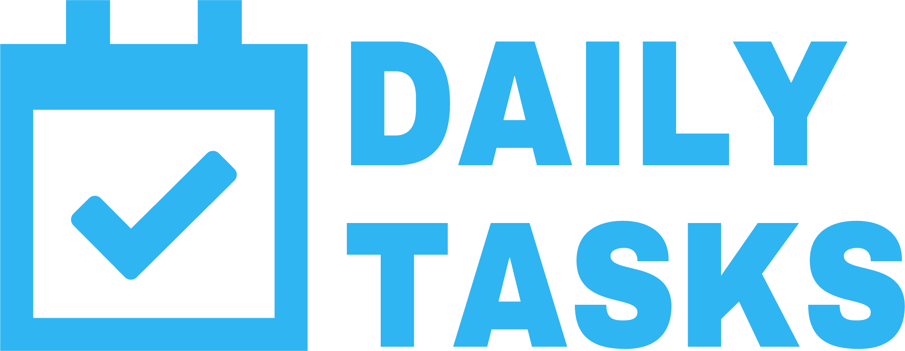

---

### *Easily track your daily tasks*
<br />

#### Getting Started:
1. Sign up by clicking [here](https://dailytasks.spiders.co.in/register)<br/>
	
1. Easily add/edit tasks<br/>
	
1. Manage pending/completed tasks list<br/>
	
<br />

#### Major Technologies Used:
1. [Laravel v8.40](https://laravel.com)
1. [React v17.0.2](https://reactjs.org)
1. [Inertia](https://inertiajs.com)
<br />

#### Installation:
1. Clone the repository in your project working directory
	```bash
		git clone https://github.com/Gauravbhatt19/daily-tasks.git
	```
1. Create & configure environment/database values in `.env` from `.env.example` file
1. Install dependencies
	```bash
		composer install
		npm install
		php artisan migrate
	```
1. Generate new Application Key
	```bash
		php artisan key:generate
	```
1. Set `<project_home_directory>\public` in virtualhost as project directory

##### :tada: Hurray! You're all set to start the development.
<br />

#### Build steps for assets:
- Development
	```bash
		npm run development
	```
- Production
	```bash
		npm run production
	```
<br />

#### Run the command to generate API Docs

```bash
	php artisan scribe:generate
```

<br />

#### Contribution:
If you have a patch or facing any issue, please consider contributing to this repository.<br>
[Report Issue](https://github.com/Gauravbhatt19/daily-tasks/issues/new)
